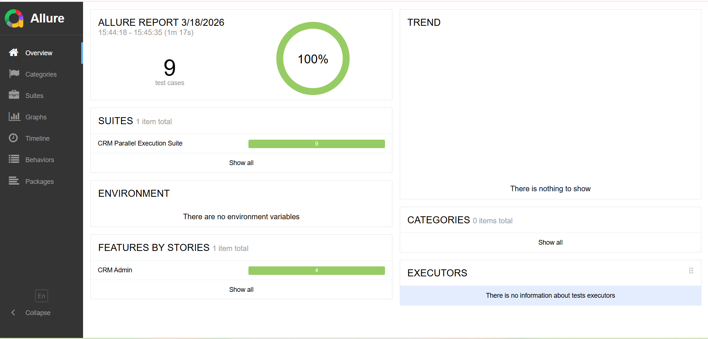
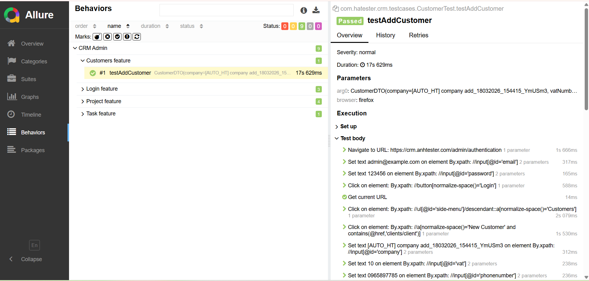

# 🚀 CRM Automation Testing Framework


A scalable UI test automation framework built with Java, TestNG, and Selenium, featuring a data-driven architecture, DTO-based test design, and Allure reporting integration.

This project demonstrates how to build a maintainable and extensible automation framework for real-world CRM applications.

👉 Unlike basic automation projects, this framework applies DTO-based data modeling and layered architecture to simulate real-world enterprise QA systems.

---

## 🌟 Why This Project Stands Out

- Implements DTO-based data modeling instead of basic test data handling
- Applies layered architecture similar to enterprise-level frameworks
- Focuses on scalability, maintainability, and clean code practices
- Designed with CI/CD readiness in mind

---

## 📌 Key Highlights

* Designed and implemented a **data-driven test automation framework** using Excel and TestNG DataProviders
* Applied **Page Object Model (POM)** to improve maintainability and reduce code duplication
* Built a **test data abstraction layer (DTO + Mapper)** to separate test data from test logic
* Implemented reusable **keyword-driven actions** for better readability and reusability
* Integrated **Allure reporting** with automatic screenshot capture on failure
* Structured a scalable test architecture: **Test → Data → Business (Keywords) → Page (POM) → UI**

---

## 🎯 Purpose

This project simulates a real-world CRM testing environment, focusing on:

* Scalable test design
* Clean architecture
* Data-driven testing strategies
* Maintainability and reusability

---

## 📘 Overview

This framework provides a structured approach to UI automation with clear separation of concerns and reusable components. It is designed to be easily extended and integrated into CI/CD pipelines.

---

## 🧪 Test Coverage

This framework covers key CRM functionalities:

- **Authentication**: Login
- **Customer Management**: Add Customer
- **Task Management**: Add Task
- **Project Workflows**: Add/Edit/Delete/Search Projects

---

## 🧩 Architecture

### Test Flow

```
Test → DataProvider → Excel → Mapper → DTO → Steps → Page Object → Selenium
       │
       └─ Core Layer: BaseTest, DriverManager, Listeners (setup, teardown, screenshot, Allure)
```

### Layers

* **Test Layer**: TestNG test cases
* **Data Layer**: Excel, DTO, Mapper
* **Business Layer**: Step classes
* **UI Layer**: Page Objects
* **Core Layer**: BaseTest, Driver, Listeners

---

## 💡 Design Decisions

- DTO + Mapper: separates test data from business logic, improving maintainability and scalability
- DataProvider: enables flexible and scalable data-driven execution
- POM: encapsulates UI interactions and reduces duplication
- Step Layer: abstracts business logic for better readability and reuse

---

## 🛠 Technologies

* Java (JDK 17+)
* Maven
* TestNG
* Selenium WebDriver
* Apache POI
* Allure Report
* Log4j2

---

## ⚙️ Setup & Installation

```bash
git clone https://github.com/Tranthuha19982015/crm-automation-testing.git
cd crm-automation-testing
```

### Requirements

* JDK 17+
* Maven 3.6+
* ChromeDriver / EdgeDriver (or WebDriverManager)

---

## ▶️ Running Tests

Run all tests:

```bash
mvn clean test
```

Run a specific test:

```bash
mvn -Dtest=AddTaskTest test
```

Run with parameters:

```bash
mvn test -Denv=staging -Dbrowser=chrome
```

---

## 📊 Allure Report

Generate report:

```bash
allure generate target/allure-results -o target/allure-report
```

View report:

```bash
allure serve target/allure-results
```

---

## 📸 Demo & Test Execution
The following screenshots illustrate test execution flow and reporting capabilities:
- Data-driven execution using DTO
- Clear step-level logging
- Scalable test architecture
- Integration with Allure reporting

### Test Results (Allure Report)

<h4>Overview</h4>
<p>Shows test execution summary with pass rate and suite distribution.</p>


<h4>Test Details</h4>
<p>Displays step-by-step execution, test data (DTO), and actions performed.</p>


---

## 🧱 Project Structure

```bash
📁 src
├── 📁 main
│   ├── 📁 java/com/hatester
│   │   ├── 📁 config          # FrameworkConfig.java: runtime config loader
│   │   ├── 📁 constants       # ExcelConstant, MessageConstant
│   │   ├── 📁 drivers         # DriverFactory, DriverManager
│   │   ├── 📁 drivers/strategy # Browser strategies (Chrome, Edge, Firefox)
│   │   ├── 📁 enums           # BrowserType, CRMEnum, MatchType, ProjectTableColumn, TaskTableColumn
│   │   ├── 📁 helpers         # CaptureHelper, ExcelHelper, PropertiesHelper, RuntimeDataHelper, SystemHelper
│   │   ├── 📁 keywords        # WebUI facade & keyword-driven actions
│   │   │   ├── 📁 browser
│   │   │   ├── 📁 element
│   │   │   ├── 📁 wait
│   │   │   ├── 📁 form
│   │   │   ├── 📁 scroll
│   │   │   ├── 📁 interaction
│   │   │   ├── 📁 verify
│   │   │   └── 📁 context     # Fine-grained action classes
│   │   ├── 📁 reports         # Reporting utilities (Allure helpers)
│   │   └── 📁 utils           # LogUtils and other small reusable utilities
│   │
│   └── 📁 resources
│       └── 📁 META-INF         # Framework-level resources
│           └── 📁 services     # ServiceLoader configs for AllureListener & reporting
│
├── 📁 test
│   ├── 📁 java/com/hatester
│   │   ├── 📁 commons         # BaseTest, BasePage (shared test behaviors)
│   │   ├── 📁 dataproviders   # DataProviderFactory: TestNG @DataProvider
│   │   ├── 📁 listeners       # AllureListener, TestListener
│   │   ├── 📁 crm
│   │   │   ├── 📁 models      # DTOs: CustomerDTO, LoginDTO, ProjectDTO, etc.
│   │   │   ├── 📁 mappers     # Mapper classes: Excel → DTO
│   │   │   ├── 📁 pages       # Page Objects: LoginPage, DashboardPage, CustomerPage, etc.
│   │   │   └── 📁 steps       # Business-level steps: CustomerSteps, ProjectSteps, TaskSteps
│   │   └── 📁 testcases       # TestNG test classes: LoginTest, CustomerTest, ProjectTest, TaskTest
│   │
│   └── 📁 resources
│       ├── 📁 configs         # config.properties (runtime flags)
│       ├── 📁 fileupload      # Sample files used in upload tests
│       ├── 📁 suites          # TestNG suite XMLs (parallel, e2e, etc.)
│       └── 📁 testdata        # Excel workbook (dataCRM.xlsx)
│
├── 📁 exports
│   ├── 📁 logs                # Test execution logs
│   ├── 📁 screenshots         # Screenshots captured on test failure
│   └── 📁 videos              # Optional video recordings
│
├── 📁 target                  # Compiled classes, Allure results, reports
├── 📄 .gitignore               # Git ignore rules
├── 📄 pom.xml                  # Maven project descriptor (dependencies, plugins)
└── 📄 README.md                # Project overview & instructions
```

---

## 🔑 Key Components

**DataProviderFactory**

* Dynamic test data generation
* Connects Excel → DTO → TestNG

**ExcelHelper**

* Reads structured Excel data
* Returns Map or Object[][]

**DTOs & Mappers**

* Clean data modeling
* Separate test data from logic

**BaseTest & Listeners**

* WebDriver lifecycle management
* Screenshot capture on failure
* Allure integration

---

## ⚡ CI/CD (Suggested)

This framework is CI-ready and supports headless execution for pipeline integration.

Although CI/CD is not yet implemented, it can be easily integrated using the following pipeline steps:

### Example Pipeline Steps

1. Checkout source code
2. Install JDK & Maven
3. Run tests:

   ```bash
   mvn clean test -Denv=ci -Dbrowser=chrome -Dheadless=true
   ```
4. Archive Allure results (`target/allure-results`)

Optional:

* Use Selenium Grid / Selenoid
* Integrate with GitHub Actions or Jenkins

---

## 🐞 Troubleshooting

* **Driver issues** → Check browser compatibility
* **DataProvider errors** → Verify Excel headers
* **Missing Allure results** → Check `target/allure-results`
* **Dependency conflicts**:

```bash
mvn dependency:tree
```

---

## 📏 Best Practices

* Page Object Model (POM)
* Data-driven testing
* Separation of concerns
* Reusable components
* No hardcoded test data

---

## 📚 References

* [https://testng.org](https://testng.org)
* [https://maven.apache.org](https://maven.apache.org)
* [https://www.selenium.dev](https://www.selenium.dev)
* [https://docs.qameta.io/allure/](https://docs.qameta.io/allure/)

---

## 🤝 Contributing

Feel free to open issues or submit pull requests. Contributions are welcome!

## 👩‍💻 Author

**Ha Tran**  
QA Automation Engineer

- GitHub: https://github.com/Tranthuha19982015